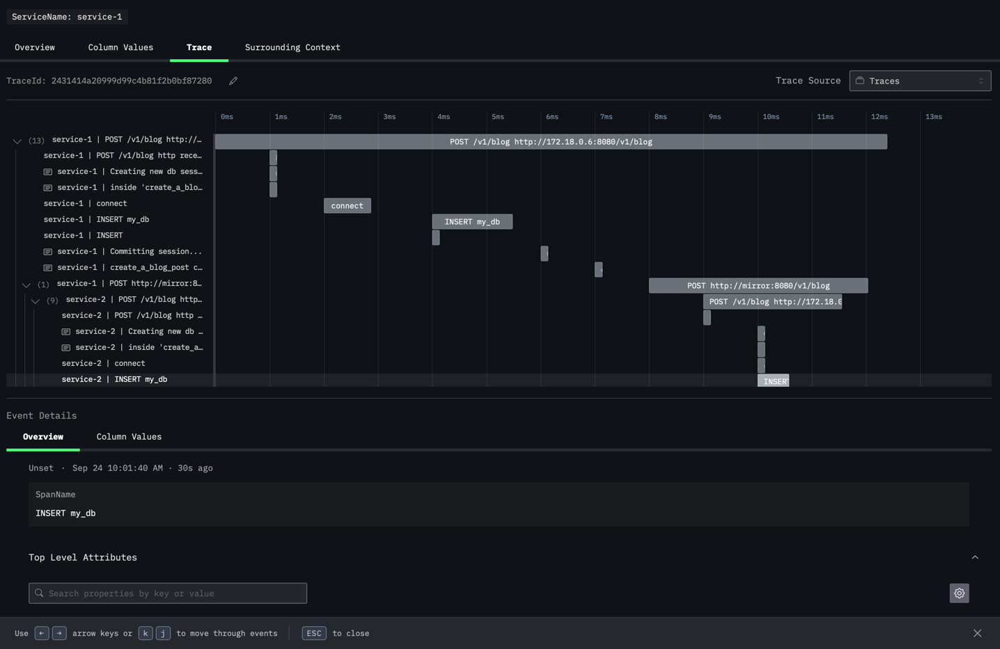

# Observability demo

A demo setup for testing out [OpenTelemetry](https://opentelemetry.io) and
[ClickStack](https://clickhouse.com/use-cases/observability) for distributed tracing and logging.

## What's new

This project is completely the same as my [FastAPI Template](https://github.com/execreate/fastapi-template),
except for some minor changes. This is a very silly (but okay for the demo) setup with two identical apps where
the [first one](./one) mirrors all requests to the [second one](./two). The [Docker Compose file](./docker-compose.yml)
has also been adapted to spin up both apps with separate PostgreSQL databases.

### How to run

1. Copy-paste the content from `.env.example` to `.env` for both apps (the [first one](./one) and
   the [second one](./two)).
2. Run `docker compose up -d clickstack`.
3. Open http://localhost:8081, set up your ClickStack user and copy the ingestion API key into your `.env`.
4. The run `docker compose up -d` to start the rest of the components.
5. Run [Locust](https://locust.io) for load tests.
6. Open http://localhost:8089 to access Locust UI. Set the host parameter to the first app URL `http://localhost:8091`,
   adjust other parameters like test duration and concurrency, then start the test.
7. You should see the logs and traces coming in from the backend on ClickStack UI at http://localhost:8081.

### How it looks



## Original README

<details>

<summary>Click here to see the rest of original README from the FastAPI Template</summary>

## Features overview

1. [uv](https://docs.astral.sh/uv/) for dependency management.
    - Run `uv sync --group=telemetry --group=load-testing` to install all deps.
2. Docker compose for local development and testing
    1. Make sure to create `.env` file before you start (refer to `.env.example`)
    2. First start the ClickStack service with `docker compose up -d clickstack`
    3. Open http://localhost:8081, set up your ClickStack user and copy the ingestion API key into your `.env`
    4. The run `docker compose up` to start the database and the app
    5. Optionally run [Locust](https://locust.io) for load tests (beware that the `locustfile.py` was vibe-coded!)
3. [SQL Alchemy](https://www.sqlalchemy.org) and [Alembic](https://alembic.sqlalchemy.org/en/latest/) for database
   operations
    - Go to the `app/` directory and run `alembic revision --autogenerate -m "my message"` to create a new migration
    - Run `alembic upgrade head` to apply the migration
    - Run `alembic downgrade -1` to revert the migration
4. Basic authentication for the documentation page
    - Simply showcasing how auth can be handled in a FastAPI app
    - The API endpoints themselves are not protected!
    - Access the docs page at http://localhost:8080/docs, default login credentials are `docs_user` and
      `simple_password`
5. CRUD operations generic class with pagination
    - Check out the [CRUD factory](app/db/crud/base.py) for more details
    - The [blog post example](app/db/crud/blog_post.py) is a good starting point to see
      it [in action](app/api/v1/blog_post.py)
6. Async testing suite with Pytest
    - Before running unit tests you must start the database with `docker compose up -d db`
    - Run `ENVIRONMENT=test uv run pytest` to run the tests
    - Having `ENVIRONMENT=test` in your env is pretty important here because it affects
      the [CRUD factory](app/db/crud/base.py) operations and database table
      names [the SQL Alchemy base class](app/db/base_class.py)
7. [ClickStack](https://clickhouse.com/use-cases/observability) integration for logs and metrics
    - Logs are already correlated with traces, so you get a nice overview of your backend operations
    - You must use [the logging setup](app/logging_setup.py) for your logs to be properly exported to the OTEL collector
    - In any given file you'd do `from logging_setup import setup_gunicorn_logging` and then
      `logger = setup_gunicorn_logging(__name__)`
    - Logs in this demo app are for demo purposes only, make sure to review them when coding your own logic

## Demo setup

1. Clone this app and copy-paste the content from `.env.example` to `.env`
2. Run `docker compose up -d clickstack`
3. Open http://localhost:8081, set up your ClickStack user and copy the ingestion API key into your `.env`
4. The run `docker compose up` to start the database and the app
5. Run [Locust](https://locust.io) for load tests (another reminder that the `locustfile.py` was vibe-coded, feel free
   to adapt it)
6. Open http://localhost:8089 to access Locust UI. Set the host parameter to the backend URL `http://localhost:8080`,
   adjust other parameters and start the test
7. You should see the logs and traces coming in from the backend on ClickStack UI at http://localhost:8081

## Project structure

Since all app code (except tests) lives inside `app/` folder, make sure to mark that directory as Sources Root in your
IDE.

Your imports should look like this:

```python
from core.config import settings
```

and NOT like this:

```python
# this will throw an error!
from app.core.config import settings
```

The Dockerfile is also configured to copy over only the `app/` folder.

## OpenTelemetry instrumentation

To include instrumentation for your new dependencies, you can use the `opentelemetry-bootstrap` command:

```shell
uv add --group telemetry $(opentelemetry-bootstrap -a requirements)
```

</details>
